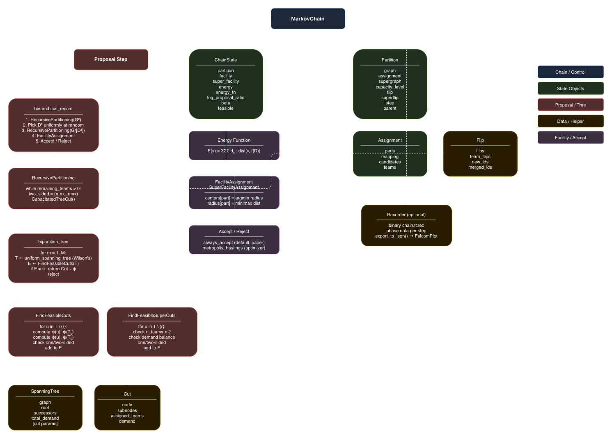

# FalcomChain

[](https://github.com/kirtisoglu/FalcomChain/actions/workflows/tests.yml)
[](https://github.com/kirtisoglu/FalcomChain/actions/workflows/docs.yml)
[](https://www.python.org/downloads/)
[](LICENSE.txt)

**FalcomChain** is a Python library for **hierarchical capacitated facility
location and districting problems** via Markov chain Monte Carlo. It samples
from the space of feasible plans, producing ensembles of contiguous districts
with facility assignments — useful for service zone design, sales territory
planning, healthcare network design, and stability analysis.

The library implements **FalCom** (Kaul & Kırtışoğlu), the first MCMC framework
that simultaneously partitions a region into capacity-respecting districts at
multiple hierarchy levels and assigns facilities, with convergence guarantees.

> **Status:** Pre-publication, under active development. The 0.1.0 API is
> stable but may evolve as the paper experiments solidify.

---

## What it does

Given a graph where nodes are geographic units with demand and facility
candidates, FalcomChain:

1. **Partitions** the graph into contiguous districts using capacitated
   spanning-tree cuts.
2. **Allocates** service teams to each district within a maximum capacity.
3. **Runs an MCMC chain** over the space of feasible hierarchical plans.
4. **Records** every chain step for ensemble analysis (boundary frequency,
   facility stability, capacity utilization).

---

## Installation

```bash
pip install falcomchain
```

For development:

```bash
git clone https://github.com/kirtisoglu/FalcomChain
cd FalcomChain
pip install -e ".[dev]"
```

Requires **Python 3.12+**.

---

## Documentation

Full documentation, tutorials, and API reference: **[falcomchain.readthedocs.io](https://falcomchain.readthedocs.io)** (coming soon).

In the meantime, browse the local docs:

|                                            |                                          |
| ------------------------------------------ | ---------------------------------------- |
| [Getting started](docs/getting_started.md) | 5-minute tutorial                        |
| [Algorithm overview](docs/algorithm.md)    | What FalCom does, conceptually           |
| [Graph schema](docs/schema.md)             | Required and optional graph attributes   |
| [GeoDataFrame guide](docs/geodataframe.md) | Building graphs from shapefiles/GeoJSON  |
| [Code structure](docs/structure.md)        | Module-by-module breakdown               |
| [Tutorials](docs/tutorials/)               | Jupyter notebook walkthroughs            |

---

## Visualization

For interactive animation of FalCom chains (district boundaries shifting,
spanning trees, facility selection), use the companion library
**[FalcomPlot](https://github.com/kirtisoglu/FalcomPlot)** (PyPI release
coming soon).

---

## Architecture



---

## Citation

If you use FalcomChain in your research, please cite the paper:

```bibtex
@article{kaul2026falcom,
  title={FalCom: An MCMC Sampling Framework for Facility Location and Districting Problems},
  author={Kaul, Hemanshu and K{\i}rt{\i}{\c{s}}o{\u{g}}lu, Alaittin},
  year={2026},
}
```

---

## Contributing

See [CONTRIBUTING.md](CONTRIBUTING.md).

---

## License

MIT — see [LICENSE.txt](LICENSE.txt).
