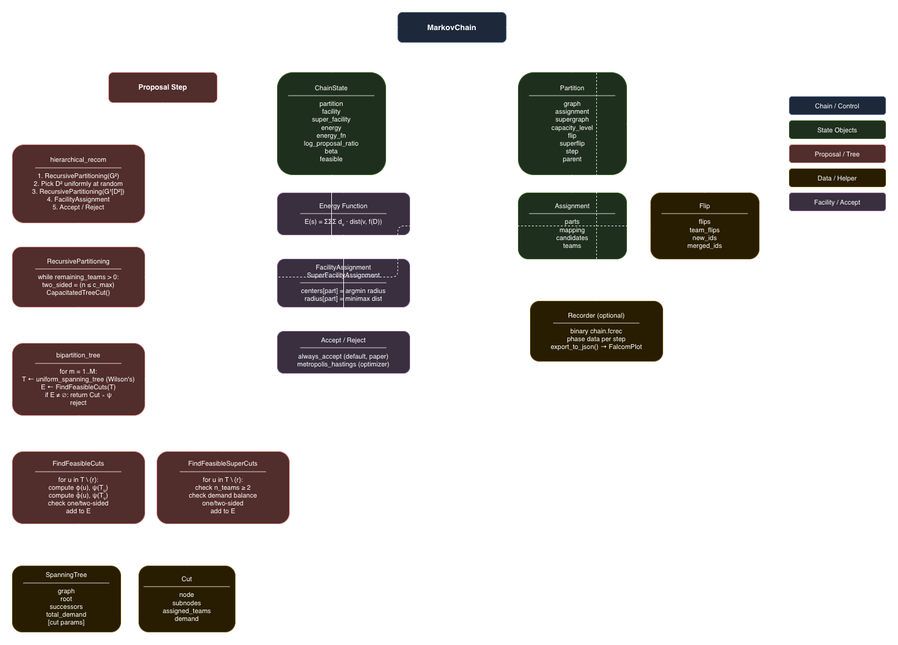

# FalcomChain

[](https://github.com/kirtisoglu/FalcomChain/actions/workflows/tests.yml)
[](https://github.com/kirtisoglu/FalcomChain/actions/workflows/docs.yml)
[](https://www.python.org/downloads/)
[](LICENSE.txt)

**FalcomChain** is a Python library for **hierarchical capacitated facility
location and districting problems** via Markov chain Monte Carlo. It samples
from the space of feasible plans, producing ensembles of contiguous districts
with facility assignments — useful for service zone design, sales territory
planning, healthcare network design, and stability analysis.

The library implements **FalCom** (Kırtışoğlu & Kaul), the first MCMC framework
that simultaneously partitions a region into capacity-respecting districts at
multiple hierarchy levels and assigns facilities, with per-step feasibility
guarantees on the recursive construction.

> **Status:** Pre-publication, under active development. The 0.1.0 API is
> stable but may evolve as the paper experiments solidify.

---

## What it does

Given a graph where nodes are geographic units with demand and facility
candidates, FalcomChain:

1. **Partitions** the graph into contiguous districts using capacitated
   spanning-tree cuts.
2. **Allocates** service teams to each district within a maximum capacity.
3. **Runs an MCMC chain** over the space of feasible hierarchical plans.
4. **Records** every chain step for ensemble analysis (boundary frequency,
   facility stability, capacity utilization).

---

## Installation

FalcomChain is not yet on PyPI. Install the latest version from GitHub:

```bash
pip install "git+https://github.com/kirtisoglu/FalcomChain.git"
```

For development:

```bash
git clone https://github.com/kirtisoglu/FalcomChain
cd FalcomChain
pip install -e ".[dev]"
```

Requires **Python 3.12+**.

---

## Documentation

Full documentation, tutorials, and API reference: **[falcomchain.readthedocs.io](https://falcomchain.readthedocs.io)**.

You can also browse the documentation sources. The docs cover the whole
FalCom family — FalcomTravel and FalcomPlot are documented there too,
not on separate sites:

|                                                       |                                                                  |
| ----------------------------------------------------- | ---------------------------------------------------------------- |
| [Getting started](docs/getting_started.md)            | Install and run a complete first chain in five minutes           |
| [Algorithm overview](docs/algorithm.md)               | What FalCom does, conceptually                                   |
| [GeoDataFrame guide](docs/geodataframe.md)            | Building graphs from shapefiles/GeoJSON                          |
| [Travel times](docs/travel_times.md)                  | Travel-time matrices with FalcomTravel                           |
| [Candidate feasibility](docs/feasibility.md)          | Verify Assumption 6.1 and add artificial candidates              |
| [Running a chain](docs/running_a_chain.md)            | Every knob of a chain run, end to end                            |
| [Level-2 facilities](docs/super_facility.md)          | Opt-in super-facility assignment (Eq. 18) with pluggable selector |
| [Optimization methods](docs/optimization_methods.md)  | Boltzmann acceptance, annealing, custom objectives               |
| [Ensemble analysis](docs/ensemble.md)                 | Boundary, facility, and capacity statistics across MCMC samples  |
| [Visualization](docs/visualization.md)                | Every FalcomPlot helper in one tour                              |
| [Case study](docs/working_with_real_data.md)          | The London Ambulance Service pipeline on real data               |
| [Reproducibility](docs/reproducibility.md)            | Seeding, run manifests, and exact chain replay                   |
| [Contributing](CONTRIBUTING.md)                       | Bug reports, dev setup, and what we welcome                      |
| [Graph schema](docs/schema.md)                        | Required and optional graph attributes                           |
| [Tutorials](docs/tutorials/)                          | Jupyter notebook walkthroughs                                    |

---

## Companion libraries

FalcomChain is one of three small, decoupled libraries that together
cover the FalCom workflow. You can use FalcomChain alone, or compose
with the others as your workflow needs them.

| Library                                                            | Purpose                                                                                                                    | Status              |
| ------------------------------------------------------------------ | -------------------------------------------------------------------------------------------------------------------------- | ------------------- |
| **FalcomChain** *(this library)*                                   | MCMC sampler for hierarchical capacitated facility location and districting.                                               | Active              |
| **[FalcomTravel](https://github.com/kirtisoglu/FalcomTravel)**     | Travel-time matrix computation (multi-backend: r5r, OSRM, OSMnx, graph distance, Euclidean) — feeds `Assignment.travel_times`. | Active (pre-PyPI)   |
| **[FalcomPlot](https://github.com/kirtisoglu/FalcomPlot)**         | Static plotting for synthetic grids and interactive Leaflet maps for real geographies. Used by the FalcomChain doc pages.  | Active (pre-PyPI)   |

Typical end-to-end flow: build a `Graph` from your geodata, compute a
travel-time matrix with FalcomTravel, run a chain with FalcomChain,
visualize results with FalcomPlot.

---

## Architecture



---

## Citation and acknowledgment

If you use FalcomChain in your research, please cite the paper:

```bibtex
@article{kirtisoglu2026falcom,
  title={FalCom: An MCMC Sampling Framework for Facility Location and Districting Problems},
  author={K{\i}rt{\i}{\c{s}}o{\u{g}}lu, Alaittin and Kaul, Hemanshu},
  year={2026},
}
```

FalcomChain's spanning-tree partition machinery and ReCom-style
proposal architecture are built on the foundation laid by
**[GerryChain](https://github.com/mggg/GerryChain)** (MGGG Redistricting Lab).
We extend GerryChain's redistricting framework to hierarchical,
capacitated problems with two-level facility assignment, and reuse the
log-proposal-ratio insight from
[Cannon, Duchin, Randall, Rule (2022)](https://arxiv.org/abs/2008.08054).

---

## Contributing

See [CONTRIBUTING.md](CONTRIBUTING.md).

---

## License

MIT — see [LICENSE.txt](LICENSE.txt).
