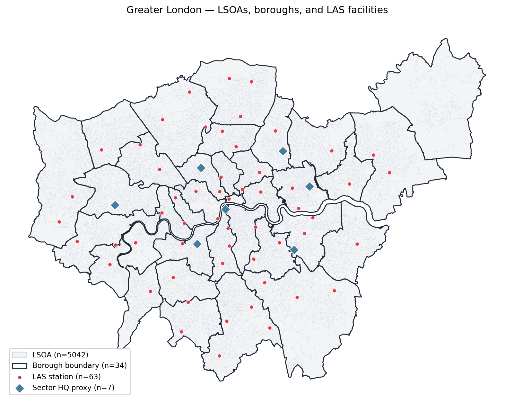

---
jupytext:
  text_representation:
    extension: .md
    format_name: myst
    format_version: 0.13
kernelspec:
  display_name: Python 3
  language: python
  name: python3
---

# Visualization with FalcomPlot

```{admonition} Goal of this page
:class: tip
A tour of every [FalcomPlot](https://github.com/kirtisoglu/FalcomPlot)
helper — static partition plots, chain animation, convergence
diagnostics, boundary-frequency maps, interactive Leaflet maps, and the
step-by-step JS chain viewer.
```

FalcomPlot is the FalCom family's visualization library. Everything the
FalcomChain docs draw comes from it; this page collects the full surface
in one place so the other pages can stay focused on their own topics.

```bash
pip install "falcomplot @ git+https://github.com/kirtisoglu/FalcomPlot.git@main"
```

The API has four groups:

| Group | Functions |
|---|---|
| Grid & partition plots | `plot_grid`, `plot_partition`, `animate_chain` |
| Convergence diagnostics | `plot_trace`, `plot_convergence`, `gelman_rubin`, `effective_sample_size` |
| Ensemble maps | `cut_frequencies`, `plot_boundary_frequency` |
| Interactive | `mapping.plott` (Leaflet), `start_server` / `animate` (JS chain viewer) |

## Setup: a chain worth plotting

We run one 300-step chain on the shared demo grid and keep the
snapshots. (See [Running a FalCom Chain](running_a_chain.md) for what
each piece means.)

```{code-cell} python
:tags: [hide-input]

import json
import math
from functools import partial

import networkx as nx

from falcomchain import (
    MarkovChain,
    Partition,
    always_accept,
    hierarchical_recom,
)
from falcomchain.markovchain.state import ChainState
from falcomchain.partition.assignment import Assignment
from falcomchain.random import set_seed

with open("_static/demo_grid_10x10.json") as f:
    graph = nx.node_link_graph(json.load(f), edges="links")

Assignment.travel_times = {
    (a, b): float(
        abs(graph.nodes[a]["C_X"] - graph.nodes[b]["C_X"])
        + abs(graph.nodes[a]["C_Y"] - graph.nodes[b]["C_Y"])
    )
    for a in graph.nodes for b in graph.nodes
}

set_seed(42)
_total = sum(d["demand"] for _, d in graph.nodes(data=True))
seed_demand_target = _total / max(1, math.ceil(_total / 1000))

partition = Partition.from_random_assignment(
    graph=graph, epsilon=0.3, demand_target=seed_demand_target,
    assignment_class=None, capacity_level=2,
)
state = ChainState.initial(partition=partition, energy=0.0, beta=1.0)

chain = MarkovChain(
    proposal=partial(hierarchical_recom, epsilon_base=0.3,
                     epsilon_super=0.3, demand_target=1000),
    constraints=lambda p: True,
    accept=always_accept,
    initial_state=state,
    total_steps=300,
)
snapshots = list(chain)
print(f"{len(snapshots)} snapshots collected")
```

## `plot_grid` — the raw instance

`plot_grid` draws the graph itself: demand shading, level-1 candidates
(blue circles), level-2 candidates (red squares), plus optional overlays
for artificial candidates and level-2 facility rings. Use it *before*
any chain runs, to sanity-check the instance.

```{code-cell} python
from falcomplot import plot_grid

plot_grid(graph, title="The demo grid — candidates and demand");
```

Overlays used elsewhere in the docs:

- `artificial_candidates=added` — orange squares for
  [feasibility repair](feasibility.md) output.
- `super_centers=state.super_facility.centers.values()` — black rings
  for [level-2 facilities](super_facility.md).
- `node_colors={node: color}` — arbitrary per-node coloring.

## `plot_partition` — one plan, fully annotated

`plot_partition` accepts a `Partition` or a `ChainState` and draws the
full districting: nodes colored by district, black-bordered stars for
each district's facility center (numbers = team counts), diamonds and
thick boundaries for level-2 super-facilities, and a parameter box
summarizing the regime.

```{code-cell} python
from falcomplot import plot_partition

plot_partition(
    graph, snapshots[-1],
    title=f"Final plan (step {len(snapshots) - 1})",
    demand_target=1000, c_min=1, c_max=2, epsilon=0.3,
    demand_target_super=1000, c_max_super=2, epsilon_super=0.3,
);
```

Two flags worth knowing:

- `show_all_candidates=True` — draw every candidate site, not just the
  selected centers (diagnostic view).
- `show_boundaries=True` — draw level-1 boundary edges explicitly
  (off by default, since node colors already encode membership).

## `animate_chain` — watch the chain move

`animate_chain` builds a matplotlib `FuncAnimation` over a sequence of
partitions or states; in a notebook, wrap it in `HTML(...)` for an
embedded player. We subsample to every 10th snapshot to keep the file
small:

```{code-cell} python
from IPython.display import HTML
from falcomplot import animate_chain

anim = animate_chain(
    graph, snapshots[::10], interval=400,
    centers_fn=lambda s: s.facility.centers,
    demand_target=1000, c_min=1, c_max=2, epsilon=0.3,
)
HTML(anim.to_jshtml())
```

## Convergence diagnostics

`plot_trace` overlays scalar traces from one or more chains;
`plot_convergence` adds post-burn-in distributions and the split
Gelman–Rubin statistic $\hat R$. Both take plain lists of floats, so
you can trace any per-step scalar: cut-edge count, energy, district
count, max covering radius.

```{code-cell} python
import falcomplot as fp

def run_chain(seed, steps=300):
    set_seed(seed)
    p = Partition.from_random_assignment(
        graph=graph, epsilon=0.3, demand_target=seed_demand_target,
        assignment_class=None, capacity_level=2)
    s = ChainState.initial(partition=p, energy=0.0, beta=1.0)
    trace = []
    def record(st, accepted):
        m = st.partition.assignment.mapping
        trace.append(sum(1 for u, v in graph.edges() if m[u] != m[v]))
    list(MarkovChain(
        proposal=partial(hierarchical_recom, epsilon_base=0.3,
                         epsilon_super=0.3, demand_target=1000),
        constraints=lambda p: True, accept=always_accept,
        initial_state=s, total_steps=steps, callbacks=[record]))
    return trace

traces = [run_chain(seed) for seed in (1, 2, 3)]
burn_in = 30

fig = fp.plot_convergence(
    traces, burn_in=burn_in, value_label="cut edges",
    labels=[f"chain {i}" for i in (1, 2, 3)],
)
```

The scalar summaries behind the plot are available directly:

```{code-cell} python
rhat = fp.gelman_rubin([t[burn_in:] for t in traces])
ess = sum(fp.effective_sample_size(t[burn_in:]) for t in traces)
print(f"R-hat = {rhat:.3f}   total ESS = {ess:.0f}")
```

$\hat R$ close to 1 means independently seeded chains agree; ESS is the
number of effectively independent draws the correlated runs provide.
[Ensemble Analysis](ensemble.md) shows these diagnostics on the real
London Ambulance instance.

## Boundary-frequency maps

`cut_frequencies` counts how often each edge separates districts across
a set of sampled assignments; `plot_boundary_frequency` renders the
result. Dark edges are *robust* boundaries (drawn the same way in nearly
every sample), pale edges are fragile.

```{code-cell} python
assignments = [s.partition.assignment.mapping for s in snapshots[30:]]
edges = [(min(u, v), max(u, v)) for u, v in graph.edges()]
freqs = fp.cut_frequencies(edges, assignments)  # per-edge, aligned with `edges`

pos = {n: (d["C_X"], d["C_Y"]) for n, d in graph.nodes(data=True)}
fig = fp.plot_boundary_frequency(
    edges, freqs, pos,
    aspect="equal", floor=0.0,
    colorbar_label="boundary frequency",
    title="Which boundaries does the ensemble agree on?",
)
```

The robust boundaries lie between the five high-demand city centers —
the chain separates cities however it starts. Interior rural boundaries
stay pale because many draws are equally good. This map is the core
output of [Ensemble Analysis](ensemble.md).

## Interactive Leaflet maps

For real geographic instances, `falcomplot.mapping.plott` builds
tiled Leaflet maps: a basemap clipped to your study region, dissolved
administrative overlays, and categorized point markers with tooltips.

```python
from falcomplot.mapping import plott

m = plott.build_basemap(boundary=lsoa_gdf, center=(51.5, -0.12), zoom=10)
plott.add_hierarchy(
    m, hierarchy="borough", basemap_gdf=lsoa_gdf,
    color="#222", weight=1.6, fill_color="#fed8b1", fill_opacity=0.18,
    tooltip_fields=["borough"],
)
plott.add_markers(m, stations_gdf, categories={
    "LAS station": {"color": "#e63946", "radius": 5, "order": 0},
    "Emergency Operations Centre": {"color": "#1d3557", "radius": 8, "order": 1},
})
m.save("overview.html")
```

This is exactly how the London overview figure in the
[case study](working_with_real_data.md) is produced:



## The interactive JS chain viewer

For step-by-step forensics — which subtree was cut, what the ψ scores
were, why a proposal was rejected — FalcomPlot ships a Canvas-based
viewer that replays a recorded chain with district and spanning-tree
modes.

Record the chain with FalcomChain's `Recorder`, export, and serve:

```python
from falcomchain.tree.snapshot import Recorder

recorder = Recorder("output/", record_substeps=True)
recorder.write_header(graph, partition, params={"epsilon": 0.3, "demand_target": 1000})

chain = MarkovChain(..., recorder=recorder)
for state in chain:
    pass
recorder.close()

Recorder.export_to_json("output/", "output/json/")

import falcomplot as fp
fp.animate("output/json/")     # starts a local server and opens the viewer
```

The viewer shows district assignments with facility candidates (gold
stars), the spanning tree with root and cut nodes, and a metadata
sidebar (step number, energy, acceptance, ψ scores, admissible cut
count).

## Where to go next

- [Running a FalCom Chain](running_a_chain.md) — the mechanics behind
  the snapshots used here.
- [Ensemble Analysis](ensemble.md) — the statistics these plots render.
- [Case Study: London Ambulance Service](working_with_real_data.md) —
  the plots on a real instance.
